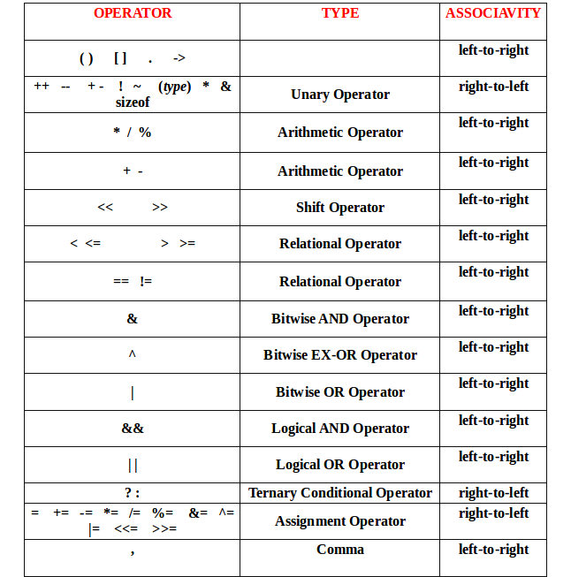

## WHAT DID JEFF SAY ABOUT THAT STUFF


Procedural compiled language telling computer what to do directly

Compilers - interpret human readable programming languages into machine cide 

Machine Langue 
bits and bops

compiled language vs. assembly language 


## Useful Tools and Resources

[Brian Kernighan C Programming Language](k&r.pdf)

[Geeks for Geeks C Tutorials](https://www.geeksforgeeks.org/c-programming-language/)

## Variables and Types


### [Types](https://www.geeksforgeeks.org/data-types-in-c/)


### Integers

Only whole number values (i.e. -1, 0 , 1 , 2 , ...)

```
//type          name
    int         myInteger; // there exists an integer called myVariable 
```

### Floats

Allows Decimal point numbers (0.1f, 1.f, -0.2222f, ... )


```
//type          name
    int         myFloat; // there exists an integer called myVariable 
```
### char

ASCII letters ('a', 'b', 'c', 'd'); 
these are secretly numbers but you can call them like this with the actual character. 

```

//type          name
    char        myChar; 

    myChar = 'a'; 

```

### string
array of chars. IGNORE THIS WE DONT CARE. but in case you care

```
char str[] = "ignore";
char* str = {'i', 'g', 'n', 'o', 'r','e', '\0'} //'\0' is the null terminator so we know the string has ended. 

```

### boolean ([bool](https://www.geeksforgeeks.org/bool-in-c/?ref=lbp))
true / false ( i.e. 0 or 1)

```
bool myBool; 

myBool = true; 

myBool = (1 < 20);  //evaluates to true

myBool = (1 > 20);  //evaluates to false 

int myInteger = 1;
int myBigInteger = 20; 

myBool = (myInteger < myBigInteger); // evaluates to true
myBool = (myInteger > myBigInteger); //evaluates to false
```


### [struct](https://www.geeksforgeeks.org/structures-c/)


## [Operators](https://www.geeksforgeeks.org/operators-in-c/?ref=lbp)

associativity meaning how the compiler will read it

### Assignment Operators  (=)   

- set something to be a value or another variable
- associativity left - to  - right

```
int myInteger; //instantiate the variable myInteger
myInteger = 7; //set myInteger to be 7

int anotherInteger = 10; // same as above but in one line

myInteger = anotherInteger; // set myInteger to be the value of anotherInteger
```

### [Arithmetic Operators (plus (+) , minus (-), divide(/), multiple (*))](https://www.geeksforgeeks.org/arithmetic-operators-in-c/?ref=lbp)


#### addition
```
int myInteger;
int result;

myInteger = 7;
result = myInteger  + 5;

//result is now 12

```
#### addition and assignment in one line

```
int myInteger = 0 ;
result;
// these three lines are equivalent. They all add 1 to myInteger 
myInteger = myInteger + 1; 
//myInteger is now 1
myInteger += 1;
//myInteger is now 2
myInteger++;  //special operator that always adds 1 does not work for any other number
//myInteger is now 3
```

#### [++ operator](https://www.geeksforgeeks.org/increment-and-decrement-operators-in-c/?ref=lbp)
just click the link
### [Boolean Operators](https://www.geeksforgeeks.org/operators-in-c-set-2-relational-and-logical-operators/?ref=lbp)
just click the link
    

## [Control Structures](https://www.geeksforgeeks.org/decision-making-c-cpp/?ref=lbp)


### [Looping](https://www.geeksforgeeks.org/c-loops/?ref=lbp)
#### [while loop](https://www.geeksforgeeks.org/c-while-loop/?ref=lbp)

```
while (condition)
{
    //doStuff
}
```
```
while(1)
{
    infinite loop
}
```

#### [for loop](https://www.geeksforgeeks.org/c-for-loop/?ref=lbp)
same as while loop but with simple way to repeat and end

```
//loop loopLength times
int loopLength = 8; 
for (int i = 0; i < loopLength; i++)
{

}
```

### [Decision Making](https://www.geeksforgeeks.org/decision-making-c-cpp/?ref=lbp)

#### [if](https://www.geeksforgeeks.org/c-if-statement/?ref=lbp)

```
if (condition)
{
    //do stuff if true
}
```

#### [if/else](https://www.geeksforgeeks.org/c-if-else-statement/?ref=lbp)
```
if (condition)
{
    //do stuff if true
}
else
{
    //do stuff if false
}
```


#### [else-if](https://www.geeksforgeeks.org/c-if-else-if-ladder/?ref=lbp)
```
if (condition)
{
    
}
else if (condition)
{

}
else
{

}
```

#### nested if
```
if (condition)
{
    if(condition)
}

```


## [Function](https://www.geeksforgeeks.org/c-functions/)


### [user defined functions](https://www.geeksforgeeks.org/user-defined-function-in-c/?ref=lbp)

> c - LEAF
> c++ - Daisy
> 
> **leaf function** 
>
> function_header(obj, variables)
>
>
> **Daisy function**
> 
> obj.function_header(variables)


