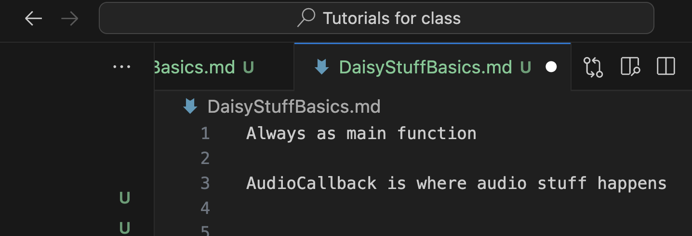

Always as main function

AudioCallback is where audio stuff happens 

right click go to definition 

back and forth with little arrows will go into and out of the things you have gone to definition of

