## Welcome to Daisy + LEAF 

This tutorial will walk you through the steps needed to get your computer ready to program the Daisy Seed and use the LEAF library


### Steps
[0.1 An Intro to the Terminal](#01-an-intro-to-the-terminal)

[1. Install Homebrew](#1-install-homebrew)

[2. Install VSCode and Xcode](#2-install-VSCode-and-xcode)

[3. Install git](#3-install-git)

[3. Set up git environment](#3-set-up-git-environment)

[3.1 Setup git ssh-keys](#31-set-up-git-ssh-keys)

[4. Intro to git](#4-intro-to-git)

[5. Install python](#5-install-python)

[6. Set Up Daisy Toolchain](#6-set-up-daisy-toolchain)

[7. Set Up LEAF](#7-set-up-leaf)


## 0.1 An Intro to the Terminal 

First things first lets open up a terminal. If you have never opened up terminal it can be found by using spotlight search. 
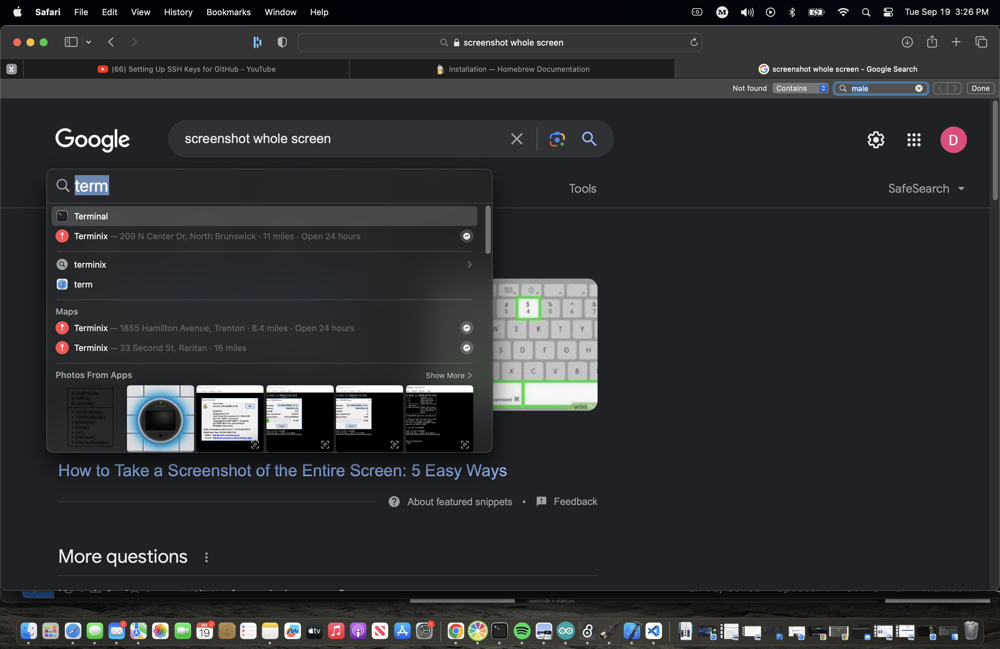

Now you will have an application window open that looks something like this

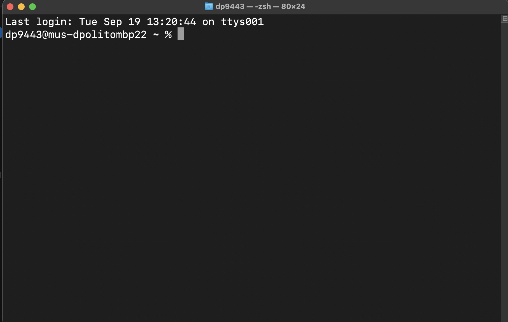

This is your terminal also referred to as the command line. This is how you interacted with computers before Graphical User Interfaces (GUIs) existed. There are lots of ways to interact with the terminal but I will only show you the commands you may need to feel comfortable setting up your environment for this class.  Most of what I am about to explain can be found in this [video](https://www.youtube.com/watch?v=aKRYQsKR46I) if that is more your speed. 

Anyway lets first figure out where we are. When your computer turns on the first thing you see after logging is the Desktop. You may know that the Desktop is a folder in your User as shown here in the finder window.
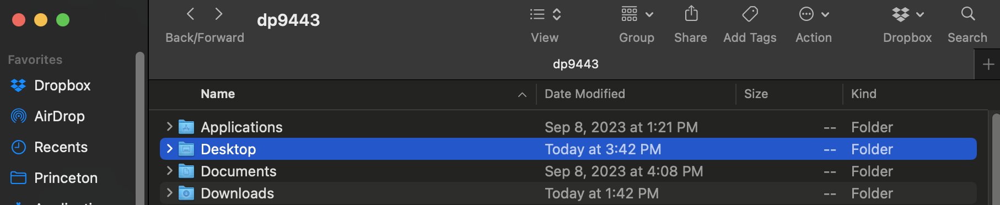

When you first open terminal you are actually one folder above that Desktop folder. The `~` you see on your terminal represents that directory at all times. You can see that by using cmd `pwd` which means 'print working directory'

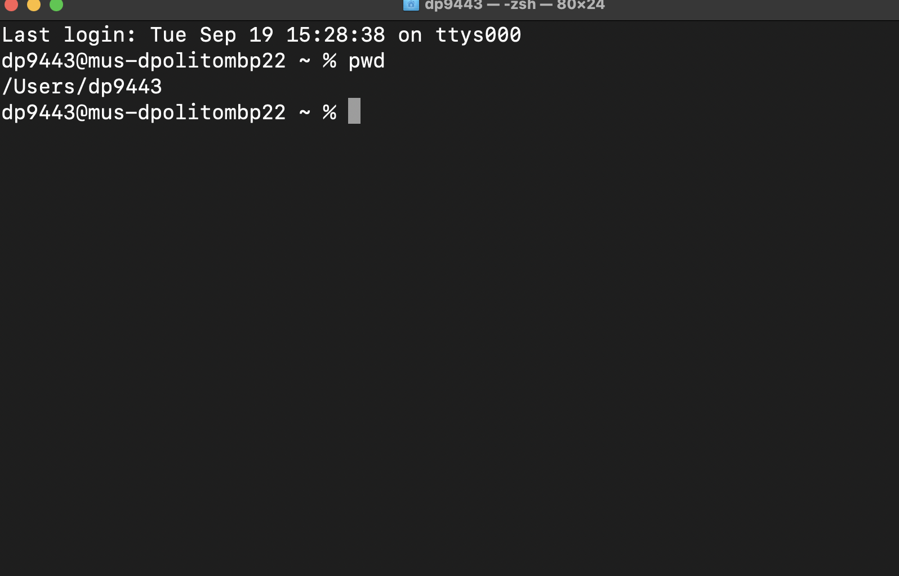

Now that we know where we are we may want to go somewhere else. To do that we use `cd` (change directory)

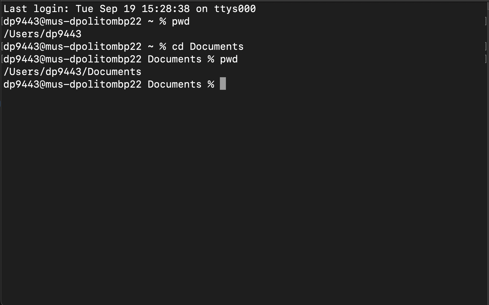

Note that I moved to the Documents directory rather than the Desktop. I prefer to put my files in documents so I don't clutter my Desktop. You can put files for your projects wherever. 

If for example you have a class folder on your computer but you don't want to cascade a million `cd` commands to get to it you can open a finder window and drag it into the terminal after a cd command and it will paste the full directory name into your terminal like so.  


(note the `\ ` convention where there is white space in your directory names. This is so the terminal can interpret the spacebar)


Now that we are in our preferred directory (folders are referred to as directories (forgot to mention that)). We may want to look around and see what files or subdirectories (a folder within a folder...ception) are in the folder. To do this we use the `ls` (list) command.

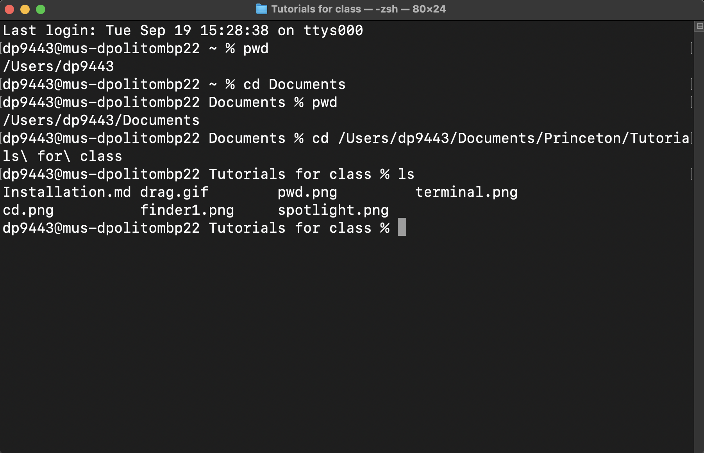

So we have gotten to where we want to be for our projects but we want to add a new folder from the terminal. We can do that with the `mkdir` (make directory) command. 

The convention would be to call this folder `dev` or `develop` so thats what I'll call it. 

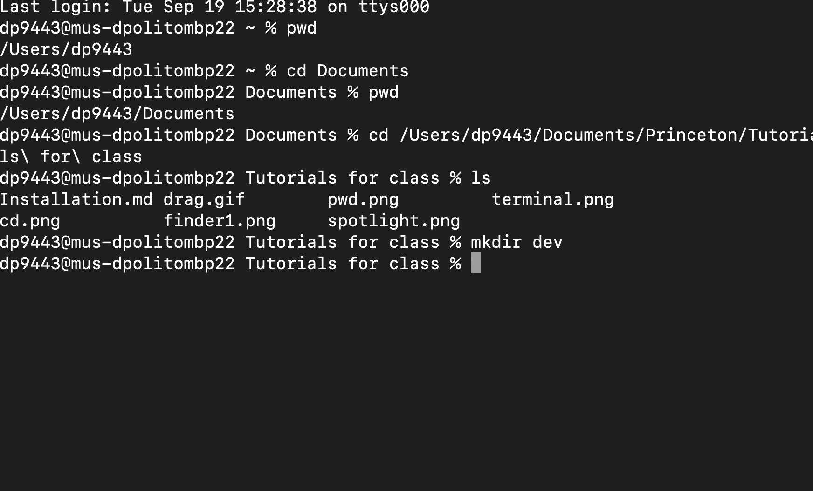


You won't see anything change but you have made a new empty folder which you can `cd` into and look around. You can also open this folder in finder using the `open`
command with a `.` after it. The `.` means this current directory. 

Now is the point where i accidentally exited my terminal and will cd back into the directory i just made so that i can show y'all how to cd out. 

Also the terminal has tab completion

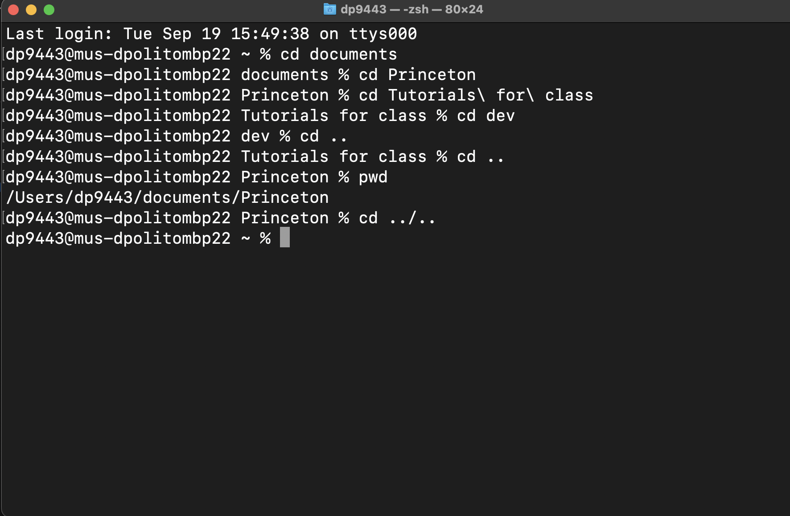


Here is a list of all the cmds you need to move around

`cd <directory>` - change directory 
`ls`             - list files and folders in current directory
`pwd`            - print working directory 
`cd ..`             - change to parent directory 
`mkdir`          - make a directory
`open <directory>` - open directory in a finder window
## 1. Install Homebrew
 

paste the below code and press enter. The terminal will prompt you about what it is doing and you can agree to it then it will begin to install

``` 
/bin/bash -c "$(curl -fsSL https://raw.githubusercontent.com/Homebrew/install/HEAD/install.sh)"
 ```

the output will look something like this at the end

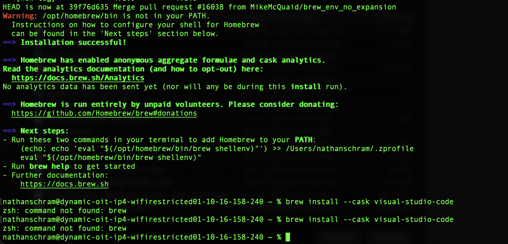

If you look at **Next Steps** it will tell you to add homebrew to your PATH. It does this by putting it into your .zprofile. The zprofile is a file that gets run by your terminal everytime it opens. 

```
echo 'eval "$(/opt/homebrew/bin/brew shellenv)"' >> /Users/<YOU>/.zprofile

eval "$(/opt/homebrew/bin/brew shellenv)" 
```
> - ```echo``` displays text 
> - ```>>``` sends your output somewhere (in this case a file)
> - ```echo 'something' >> <file>``` outputs the text 'something' to the file specified

The eval command is adding the brew command to your PATH so that you can see it in your terminal. 

We run it outside the zprofile here because the zprofile only gets run once when terminal is opened. 

if you like videos [this](https://www.youtube.com/watch?v=UTon_5ouqTM) covers homebrew and git. 

## 2. Install VSCode and Xcode
run the following command from the command line (terminal)

```
brew install --cask visual-studio-code
```

Alternatively you can download it [here](https://code.visualstudio.com) 

find Visual Studio Code in your application folder

Once it is open use hotkey `cmd-shift-p` and then type and run
```
Shell Command: Install 'Code' command in path
```

Also install Xcode command line tools

```
xcode-select --install
```
## 3. Install git


 run the following command from the command line (terminal)
```
brew install git
```
 

## 3.1 Set up git ssh-keys

First you will need to create a git account. 

Once you have created your account you will need to set up an ssh-key. You can think of this as a password that only your computer and github know about. [Here](https://www.youtube.com/watch?v=8X4u9sca3Io) is a video that I will be copying in the follow steps. 

> 1. Paste the text below into your terminal, substituing in your Github email address. 
```
ssh-keygen -t ed25519 -C "your_email@example.com"
```
> 2. When you're prompted to "Enter a file in which to save the key", you can press Enter to accept the default file location. Please note that if you created SSH keys previously, ssh-keygen may ask you to rewrite another key, in which case we recommend creating a custom-named SSH key. To do so, type the default file location and replace id_ssh_keyname with your custom key name.
```
Enter a file in which to save the key (/Users/YOU/.ssh/id_ALGORITHM): [Press enter]
```

> 3. Adding your SSH key to the ssh-agent
> - Start the ssh-agent in the background. 
> - the `$` before the command eval is just showing that its at the terminal.  Do not paste this symbol into the terminal when it is at the beginning of the line
> - the `>` is showing what the command should print out
```
$ eval "$(ssh-agent -s)"
> Agent pid 59566
```
4. Edit the .ssh/config file
> - You will need to modify your ~/.ssh/config file to automatically load keys into the ssh-agent and store passphrases in your keychain.
> - First, check to see if your ~/.ssh/config file exists in the default location.
```
$ open ~/.ssh/config
> The file /Users/YOU/.ssh/config does not exist.
```
> - If the file doesn't exist, create the file.
```
touch ~/.ssh/config
```
> - Open your ~/.ssh/config file, then modify the file to contain the following lines. If your SSH key file has a different name or path than the example code, modify the filename or path to match your current setup.

```
nano ~/.ssh/config
```
> - copy this into it 
```
Host github.com
  AddKeysToAgent yes
  IdentityFile ~/.ssh/id_ed25519
```

> - use `ctrl-x` to exit and then press `y` to save

## 4. Intro to git

Now that you have set up `git` we can learn what it does. `git` is a version control system. 

Davis, why do we care about a version control system? 

Great question! 

We care about a version control system because this means we don't have to multiple folders for our project labeled "Project 1.1", "Project v2", "Project v2 Final", "Project v2 Final copy" ... etc. ad infinitum... 

Instead, we can just use git to save snapshots of our project and recall them whenever we would like! 

So how do we take those snapshots? 

We take those snapshots by making what is called a `commit` in git. 

In order to make a commit we must first make a repo and add some stuff to it. 

So lets `cd` to a new folder that we are going to use to create a dummy git repo. 

Once in that folder we can call ```git init``` to create a new repo 

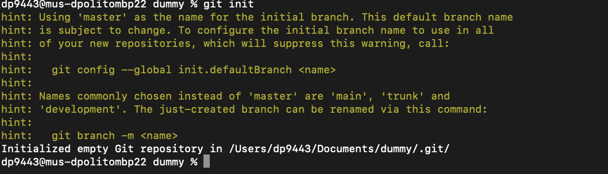

Here it says we have created an empty git repo and that we are using 'master' as our default branch name and that we can easily change that from the command line so let's do that! I'll use `main` as my new default branch name.

```
git config --global init.defaultBranch main
```
```
git branch -m main
```

Now that we have our main branch set up we should add a file to it. 

``` touch helloworld.txt```

Let's see if that changed anything in our repo! 

You can check the repo using the ```git status ``` command

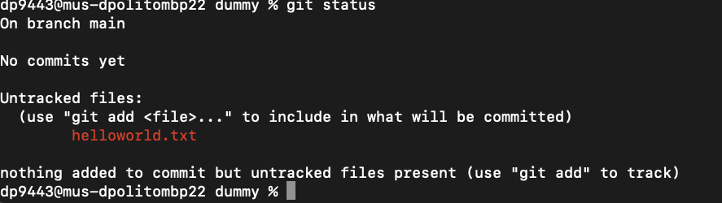

looks like our file isnt in the repo but there is a helpful hint that tells us you can use the ```git add <file>``` command.

```git add helloworld.txt```

> note that this add command can use the `.` specifier to add an entire folder to a commit.

So now that we have added it to the commit let's make a commit. 

```git commit -m "My First Commit!"```

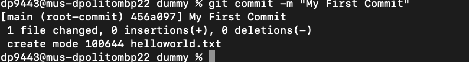

Now our empty file has been added to the git repo! 

But Davis, I want to edit this file!

Well then lets do it! First we have to choose a text editor. Lucky for you I have already chosen your text editor and had you install it. Before we start editing lets ensure git uses this text editor anytime it is needed. 

From the command line, run ```git config --global core.editor "code --wait"```

Now you can run ```git config --global -e``` and use VS Code as editor for configuring Git.

Add the following at the end of the file to use VS Code as diff tool. 

```
[diff]
    tool = default-difftool
[difftool "default-difftool"]
    cmd = code --wait --diff $LOCAL $REMOTE
```
Now lets open up our repo in VSCode! Use the command ```code .``` to take us there. 

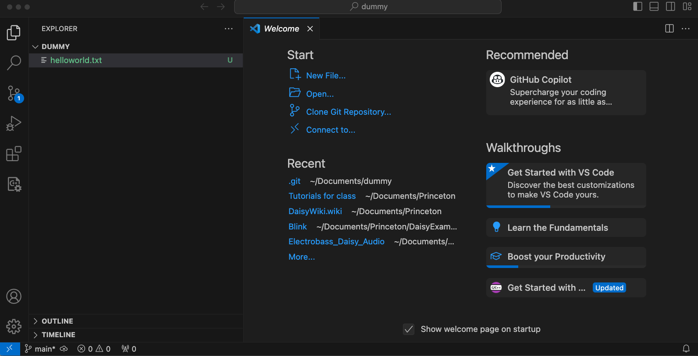


In the Explorer you can see we have our folder with our new file in it! You can also see in the bottom left that it reflects that the file is a git repo. Snazzy! There are acutally ways to do all your git management from this editor. I don't use them so I won't show them but an intro can be found [here](https://code.visualstudio.com/docs/sourcecontrol/overview). If you'd prefer to use controls from the editor feel free to try them out! 


Now that we have created our file lets add it to our repo!


You can go ahead and type the usual "Hello World!" into this file and call it a day. You will need to use the hotkey 'cmd-s' to save the file. 

You can then go back to the terminal run a ```git status ``` and git will show that the file has been modified 
> - there is also a convenient terminal in vscode if you pull the bottom of the window up 

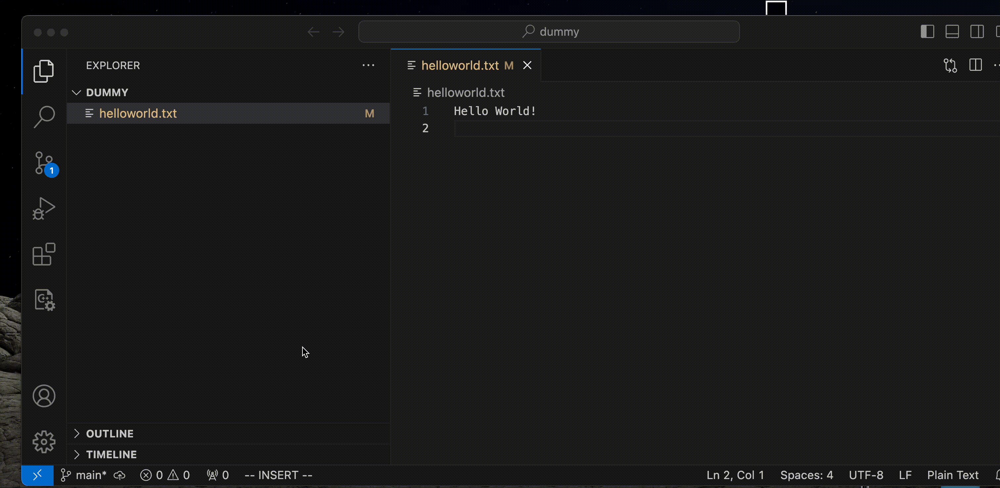

We can now add the changes to the file to our repo. 

```git add . ```

```git commit -m "Edit helloworld.txt" ```

If you use the ```git log``` command you can now see that we have two commits we can see in our repository


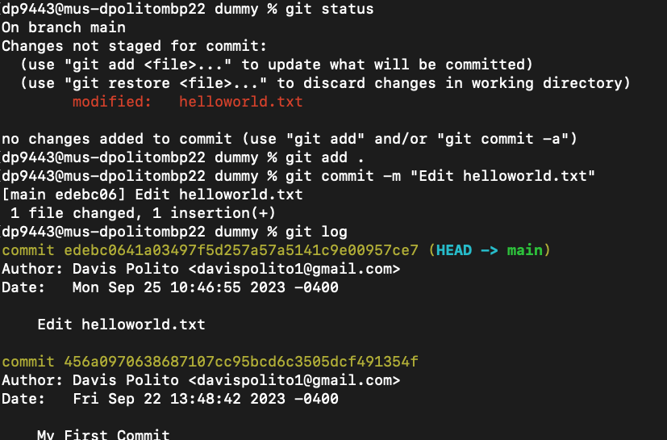

Now if we wanted to return to the previous commit we could just copy it and call the ```git checkout <hash>``` command
> - the term hash is a unique identifier generated by the coomputer that is used to represent a commit


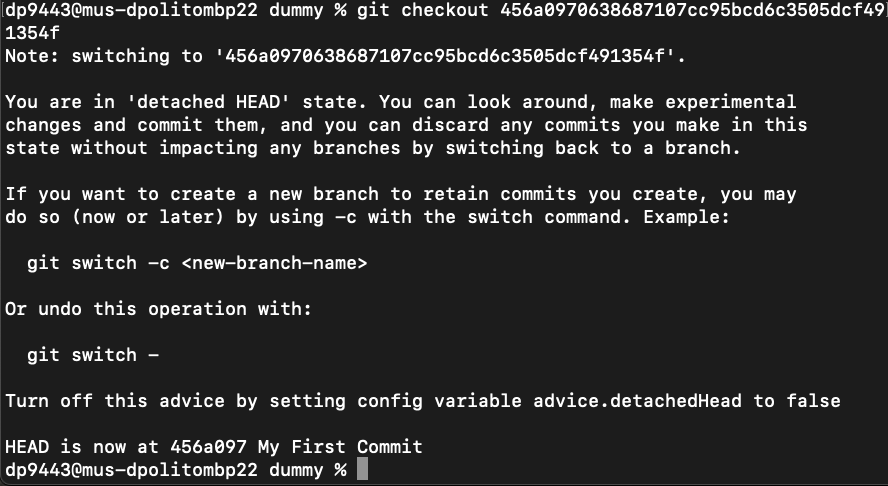

If you read the output of this function it will explain a lot of what it is. From here we can overwrite the repo and remove our previous commit or even branch off to a new commit. 

But Davis, What is branching?

Great question! 

Branching allows us to create unique directions for our project that can later be joined together. 

For example if this repo were a musical composition I could create a branch where i work on the drum track and a branch where I work on the guitar track. These two branches would function independently until I merged them together! This functionality won't be super important for our efforts but it is useful to know. Below is an example of adding some branches and switching between them. 

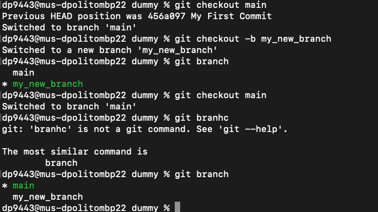


Lastly, we want to push our repo to github. For this we will have to go to github.com and create a repo so we can push our local repo to it. 

Step-by-step tutorial can be found [here](https://docs.github.com/en/get-started/quickstart/create-a-repo) 

I suggest making this private. 
 
After you have set that up github has some helpful suggestions for code you might want to use. 

```
git remote add origin git@github.com:davispolito/dummy.git
git branch -M main
git push -u origin main
```

so lets do that! 

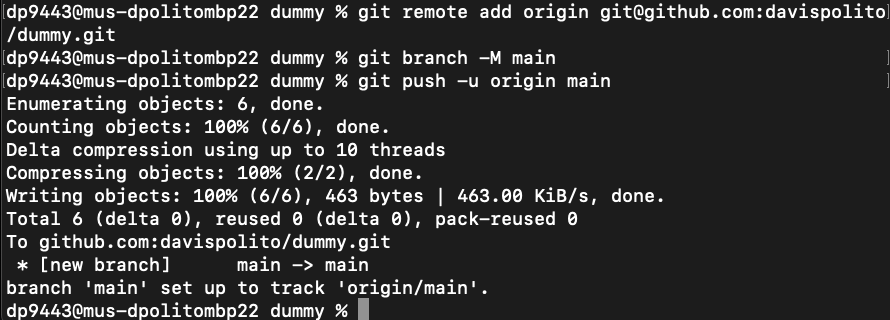

now if we checkout our repo online we can see that our 2 commits are there!

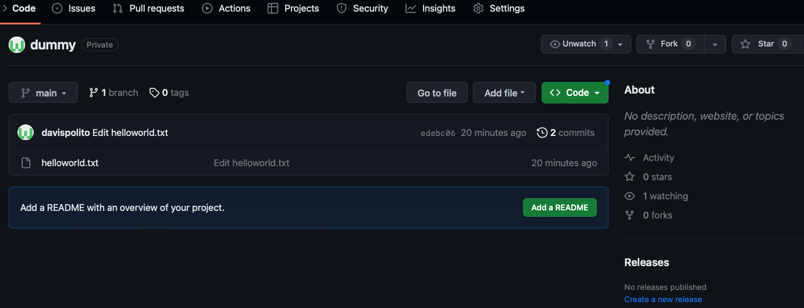

## 5. Install Python

```
brew install python
```

## 6. Set up Daisy Toolchain

Alright! Now that you want to drop this class let's figure out how we're gonna use this little yellow board. 

As I already said we will use VSCode to work with our Daisy. But first let's checkout the [DaisyWiki](https://github.com/electro-smith/DaisyWiki/wiki)

The wiki will have all the answers to your set up questions and show you exactly how to get started with programming it. For the sake of clarity I have directly copied the useful material here and included links to the relevant wiki pages. 

The Daisy has a [webprogrammer](https://electro-smith.github.io/Programmer/) which allows you to flash the example programs to your board. We are using the daisy seed so any and all programs under the seed examples will work on this board. 

We will be creating our own programs and thus need have to set up a development environment (VSCode) 

[1. Setting Up Your Development Environment](https://github.com/electro-smith/DaisyWiki/wiki/1.-Setting-Up-Your-Development-Environment)


[1b. Installing the Toolchain on Mac](https://github.com/electro-smith/DaisyWiki/wiki/1b.-Installing-the-Toolchain-on-Mac)
- [You can get the installer here](https://daisy.nyc3.cdn.digitaloceanspaces.com/installers/DaisyToolchain-macos-installer-x64-0.2.0.pkg)

  > This file will show up as quarantined if you just click on it. If you right-click Open it you will get a prompt asking you if you really want to open it and then it'll run fine. Alternatively if you just click it you'll get an error until you remove it from quarantine in the settings. 

  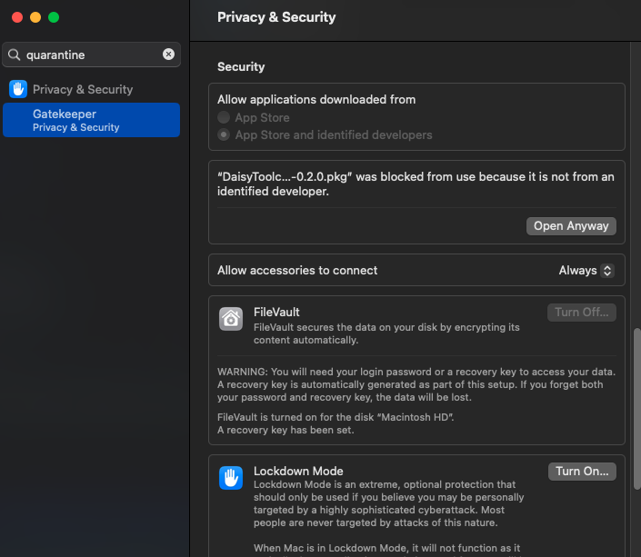
  > Once you agree to all the stuff it will install a bunch of malware on your computer and you'll be done! 

Now if we go back to the [1. Setting Up Your Development Environment](https://github.com/electro-smith/DaisyWiki/wiki/1.-Setting-Up-Your-Development-Environment)
 wiki we can pull the source for DaisyExamples
 ```
git clone --recurse-submodules https://github.com/electro-smith/DaisyExamples ~/Desktop/DaisyExamples

This command clones the repo to our Desktop but you can replace ~/Desktop/DaisyExamples/ to be wherever you want it to be. 
 ```

 After that we can go into VScode and add our debug Extension so that we can use this 

 To install the Cortex Debug extension in VS Code:

- Go to the extensions tab View > Extensions
- Search for Cortex Debug
- Find the extension by marus25 and install, it should be the top result

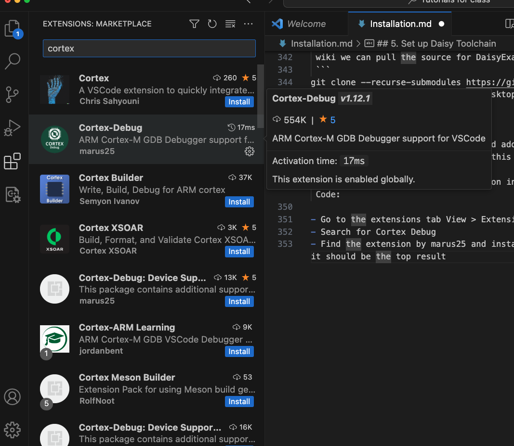

Now let's figure out how to make our own project

[How to Create A New Project](https://github.com/electro-smith/DaisyWiki/wiki/How-To-Create-a-New-Project)

WE've already set up the dev environment and installed python. now we just need to create our first projcet using the helper script

### 1. Using the Helper Script
helper.py is a python script from DaisyExamples that can be used for several helpful utilities.  

**macOS troubleshooting:** 
- Mac users may see `Permission denied` in the console when trying to run the helper script. A solution to this is to first run `chmod +x helper.py`
- Another error that may appear is `ImportError: No module named pathlib`. A solution is to add "python3" in front of the command, so you will need to run `python3 ./helper.py create MyProjects/<Project Name> --board <Target Board>

To create a brand new project containing a Makefile, compilable source file, and debug resources for VisualStudio using VisualGDB, and for VS Code using Cortex Debug:

- Open a terminal window. On macOS, this is terminal. On Windows, this is git bash (installed in the Getting Started guide).
- Move into your DaisyExamples folder with `cd <DaisyExamples location>`
  - For example if DaisyExamples is located at `C:\\Users\ES\Documents\DaisyExamples`,  
  run `cd  /c/Users/ES/Documents/DaisyExamples`.
- Next run the helper script for the board you want to target. `./helper.py create MyProjects/<Project Name> --board <Target Board>`
  - For example, if we are creating a project called MyProj for the Daisy Patch, we would  
  run `./helper.py create MyProjects/MyProj --board patch`
  
  
  
The `<Target Board>` option can be any of the following:

 - [field](https://www.electro-smith.com/daisy/field)
 - [patch](https://www.electro-smith.com/daisy/patch)
 - [ patch_sm](https://www.electro-smith.com/daisy/patch-sm)
 - [petal](https://www.electro-smith.com/daisy/petal)
 - [pod](https://www.electro-smith.com/daisy/pod)
 - [seed](https://www.electro-smith.com/daisy/daisy)
 - [versio](https://www.noiseengineering.us/versio)

To see a full list of available board targets, enter the following command:
```
./helper.py -h
```


### 2. Compiling
- Open your project in VS Code.
  - Open VS Code.
  - Click `File > Open Folder`
  - Choose your project folder. For example, the MyProj folder from step 3.
- Write the code for your example.  
(The default code is a simple passthrough, you can try compiling and flashing it!).
- Build your example with `Ctrl-shift-B`
- If you receive an error related to libDaisy or DaisySP, make sure to build your libs by running `task build_all`. This will build the libraries.
- Refer to step 3 of the [Development Environment](https://github.com/electro-smith/DaisyWiki/wiki/1.-Setting-Up-Your-Development-Environment#4-Run-the-Blink-Example) guide for help flashing your project to the Daisy.

### 3. Troubleshooting

Please refer to the [troubleshooting page](https://github.com/electro-smith/DaisyWiki/wiki/7.-Troubleshooting).


## 6. set up LEAF


Now if you only wanted to use the Daisy Libraries and DSP objects you would be done. Unfortunately, there is still work to do. 

navigate to just outside of your DaisyExamples folder and clone [leaf](https://github.com/spiricom/LEAF.git)

```
git clone git@github.com:spiricom/LEAF.git
```

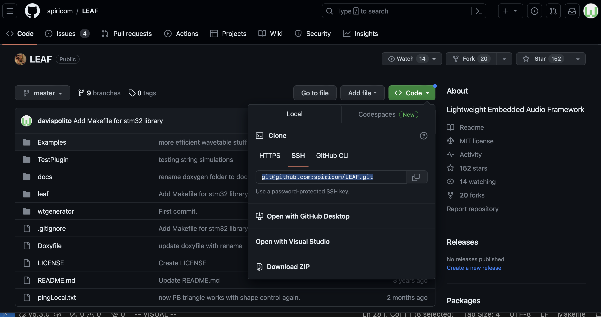
*press the blue code button to get the link needed for cloning*

It is important that DaisyExamples and LEAF are on the same directory level i.e.
Folder
  DaisyExamples
  LEAF

We will use this directory structure to access LEAF from our projects. 

I have included a zip of a working directory that allows for the use of Leaf. It assumes it is in the DaisyExamples 

